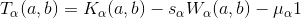

# Numerics supporting the findings in "Robust self-testing of two-qubit states"

arXiv-link: ...

The code in this repository supports the finding in the paper *Robust self-testing of two-qubit states* by Tim Coopmans, Jędrek Kaniewski and Christian Schaffner (2018, arXiv-link). Using this code one can numerically verify the positivity of the operator



over a discretization of ```(a,b) \in [0, \pi/4] \times [0, \pi/2]``` (see also eq. ... on page ... of the article). Secondly, using this code, one can also reproduce the plot from fig. 1 in the article.

## File overview

**Definitions**

 - *tiltedCHSH.py*: definition of the tilted CHSH operators and its quantum- and classical value.
 - *BNSVY2015.py*: the data as used by Bancal et al., *Physical characterization of quantum devices from nonlocal correlations* (2015),  doi: [10.1103/PhysRevA.91.022115](https://journals.aps.org/pra/abstract/10.1103/PhysRevA.91.022115).
 - *CKS2018.py*: the definitions from the paper *Robust self-testing of two-qubit states* as specified above (arXiv-link).

**Numerics**

 - *create_plot.py*: code for reproducing fig. 1 of the article.
 - *output*: folder where the plots and data produced by the code will be put.
 - *numerical_evidence_CKS2018_bounds.py*: code for numerically verifying the positibity of the operator ```T_{\alpha} (a,b)``` as defined above.

**Miscellaneous**

 - *README.md*: this file.
 - *test_implementation.py*: some tests that implementation has been done correctly.


## Running the code

The code has been written in Python and can be run from a terminal using e.g.
```
python3 numerical_evidence_CKS2018_bounds.py
```

Note: the code only works with `python3` instead of `python 2`.

To check your python version, perform
```
import sys
print(sys.executable)
```


